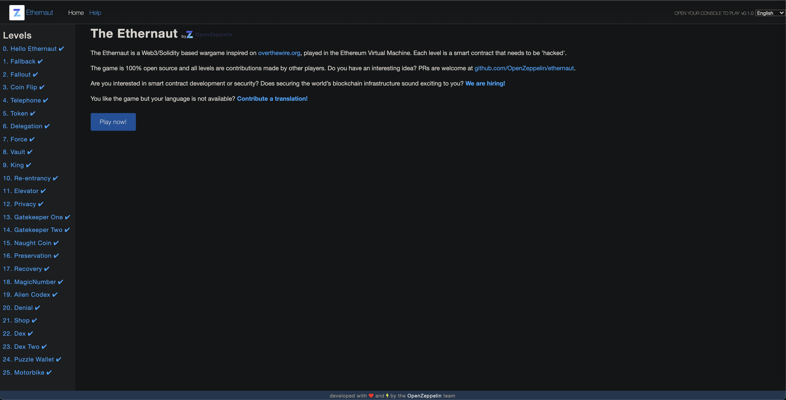

## Ethernaut using Brownie/Python3



### Create an Infura Rinkeby project at https://infura.io and add the project id and https endpoint to the .env file, along with your private key. 

* Change directory to a specific level AND update `brownie-config.yaml` with YOUR Ethernaut instance address:

```
cd level-25
```

### To run locally using mock contracts:

> Use https://trufflesuite.com/ganache to explore the mock blocks, contracts, and transactions 

```
brownie run scripts/attack.py
```


### To run via the Rinkeby Testnet:

> Use https://rinkeby.etherscan.io to explore the Rinkeby blocks, contracts, and transactions

```
brownie run scripts/attack.py --network rinkeby
```

> 


